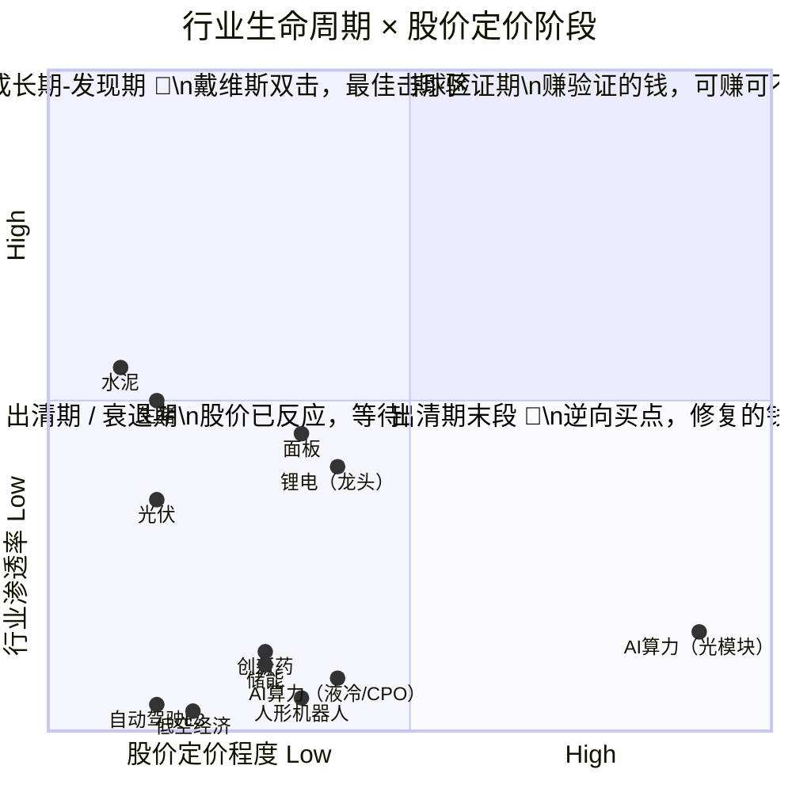
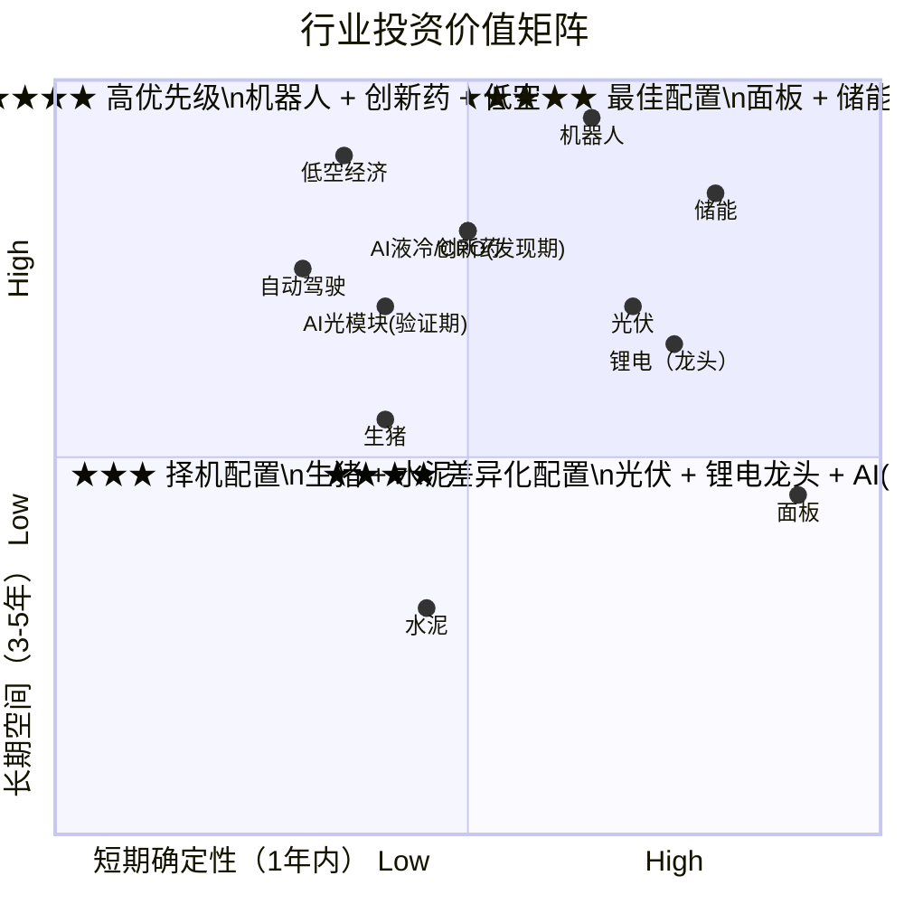

# 2026年行业生命周期全景扫描：成长前期 vs 出清期末段

**分析日期**：2026年5月30日  
**核心方法论**：以渗透率为标尺判断生命周期阶段  
**关键前提**：行业生命周期 ≠ 股价所处阶段

---

## 核心概念修正：行业阶段 ≠ 股价阶段

用渗透率判断行业生命周期是对的，但**同一个行业阶段，可以对应完全不同的股价位置**。忽略这个区别，会犯致命的误判——

```
以 AI 算力为例：

  渗透率：~10%  →  行业在成长前期 ✅
  中际旭创一年涨 16 倍，PE 75x，拥挤度 99% 分位  →  股价已经不在"发现阶段"了
  
  结论：行业还在成长前期，但"发现成长"的钱已经被人赚走了。
        现在赚的是"验证业绩"的钱 —— 性质完全不同。
```

**因此，成长前期需拆成两个子阶段**：

| 子阶段 | 渗透率 | 股价位置 | 赚什么钱 | 收益空间 | 典型状态 |
|--------|--------|---------|---------|---------|---------|
| **发现期** | < 10% | 无人关注 / 刚起步 | 发现的钱 + 业绩的钱（戴维斯双击） | 3-5年 5-10倍 | 渗透率低 + 预期低 |
| **验证期** | 10-25% | 已被充分定价 | 只剩业绩验证的钱 | 1-3年 0-2倍（甚至不赚钱） | 渗透率低 + 预期高 |

> **同一个"成长前期"，发现期是金矿，验证期是考场。考场也能赚钱，但考砸了就是戴维斯双杀。**

---

## 总览：2026年A股主要行业生命周期与股价阶段



> **右上角 = 最佳击球区**（渗透率低 + 股价未充分定价）：人形机器人、储能、低空经济。  
> **右下角 = 逆向买点**（渗透率不低 + 股价被过度打压）：光伏、面板、生猪。

---

## 一、成长前期-发现期（渗透率低 + 股价预期低 → 戴维斯双击）

### 共性特征

```
├── 渗透率：< 10%，仍在低位加速
├── 股价：尚未被广泛关注，机构配置低
├── 赚什么：发现的钱（估值扩张）+ 业绩的钱（利润增长）
├── 收益：3-5年 5-10 倍
├── 风险：技术路线未收敛，伪需求可能
└── 最佳买点：现在（"别人还没看懂的时候"）
```

---

---

### 1. 人形机器人 ⭐⭐⭐⭐⭐

| 维度 | 现状 |
|------|------|
| **渗透率** | < 5%（刚从实验室走向产业化） |
| **股价定价** | 中低（机构刚开始建仓，散户关注度不高） |
| **行业增速** | 2026出货量同比+177%，中国市场规模~90亿（+200%） |
| **催化事件** | 特斯拉弗里蒙特工厂2026年7-8月大规模量产，首条线年产能100万台 |
| **确定性** | 极高，2026=量产元年，从"讲故事"到"交业绩" |

**零部件价值量排序**：
```
执行器总成(35-40%) > 丝杠(18-20%) > 无框电机(16%) > 减速器(15%) > 传感器(11%) > 灵巧手(8-10%)
```

**重点关注**：

| 环节 | 标的 | 核心逻辑 |
|------|------|----------|
| 谐波减速器 | 绿的谐波 | 国内市占率>60%，Q1净利同比+2700% |
| 丝杠 | 五洲新春、恒立液压 | 价值量最高，壁垒最深 |
| 执行器总成 | 三花智控、拓普集团 | 特斯拉链核心供应商 |
| 灵巧手 | 兆威机电 | 单台用量~20个空心杯电机 |

**风险提示**：量产进度不及预期、技术路线（电动vs液压vs气动）未完全收敛。

**与AI算力的对比**：同样是成长前期，人形机器人处在"发现期"（股价未充分定价），AI算力已进入"验证期"（股价涨了16倍）。前者赚的是发现的钱+业绩的钱，后者只剩业绩验证的钱。

---

### 2. 新型储能 ⭐⭐⭐⭐⭐

| 维度 | 现状 |
|------|------|
| **渗透率** | < 15%（工商业储能极度不饱和） |
| **股价定价** | 中低（储能PCS/系统环节，非电芯） |
| **行业增速** | 45%-50%（2026年全球储能增速近70%） |
| **判断信号** | 强制配储政策 + AI算力催化 + 工商业"一柜难求" |
| **确定性** | 极高，碳中和硬约束 + 容量电价落地 |

**重点关注**：阳光电源（逆变器+大储双龙头）、宁德时代（储能电池全球25%+份额）、亿纬锂能（储能电池全球第二，增速最快）

**注意区分**：储能电池环节（宁德、亿纬）因锂电整体出清，股价有一定压制，属于发现期与验证期之间。储能PCS/系统（阳光电源）更偏发现期。

---

### 3. 低空经济 / eVTOL ⭐⭐⭐⭐

| 维度 | 现状 |
|------|------|
| **渗透率** | < 5%（配套服务严重不足） |
| **股价定价** | 低（板块刚形成，标的稀缺，机构覆盖少） |
| **行业增速** | 年复合25-50%，2026年有望破万亿~2万亿 |
| **催化事件** | 新《民用航空法》2026年7月实施，300米以下低空开放，12个示范区 |
| **确定性** | 中高，2026=商用元年 |

**重点关注**：亿航智能（eVTOL取证领先）、小鹏汇天（飞行汽车）、空管/通信/导航基础设施企业

**风险提示**：适航认证进度不确定、商业模式待验证。

---

### 4. 自动驾驶 L3+ ⭐⭐⭐

| 维度 | 现状 |
|------|------|
| **渗透率** | < 5%（政策刚开放L3准入） |
| **股价定价** | 低（智驾板块刚经历一轮杀估值） |
| **行业增速** | 2026=商业化起步元年，弹性高 |
| **催化事件** | 长安/北汽获L3牌照、特斯拉FSD迭代、车路云一体化 |
| **确定性** | 中高 |

**重点关注**：禾赛科技（激光雷达）、德赛西威（域控制器）、经纬恒润

**风险提示**：L4/L5时间表不确定，监管政策可能变动。

---

### 5. 创新药出海 ⭐⭐⭐⭐

| 维度 | 现状 |
|------|------|
| **渗透率** | 低（大量病种远未被满足） |
| **股价定价** | 分化（龙头已有一定定价，Biotech仍被低估） |
| **行业增速** | 15-30% |
| **催化事件** | AI制药缩短研发周期50-60%、BD出海屡创新高、人口老龄化 |
| **确定性** | 中高，但选股难度大 |

**重点关注**：百济神州（全球化标杆）、恒瑞医药（BD转型）、ADC/CAR-T管线丰富的Biotech

**风险提示**：临床失败风险、FDA审批不确定、地缘政治。

---

## 一B、成长前期-验证期（渗透率低 + 股价预期高 → 只剩业绩验证）

### 共性特征

```
├── 渗透率：仍在 < 25%，空间没问题
├── 股价：已经涨了 5-16 倍，预期打得极满
├── 赚什么：只有业绩超预期的钱（估值扩张空间已很小）
├── 收益：1-3年 0-2倍；如果业绩miss，可能戴维斯双杀
├── 风险：拥挤交易踩踏、供给缓解后价格回落、技术替代
└── 策略：已有仓位可持有（Forward PE尚合理），新建仓性价比低
```

---

### AI算力硬件（光模块/服务器/液冷/CPO）⭐⭐⭐

| 维度 | 现状 |
|------|------|
| **渗透率（行业）** | 1.6T光模块 ~10%，CPO 0%，液冷 15%，企业AI采用仍极低 |
| **股价定价（市场）** | **已达"成长后期"水准** |
| 中际旭创涨幅 | 一年 ~16倍（70→1200元），创业板第二只千元股 |
| TTM PE | 75倍（2027E 18倍） |
| 交易拥挤度 | **99.2%历史分位**，换手率 267%（正常50-100%） |
| 公募配置 | 从2.7%暴增至13.1%，Q1仅微幅加仓0.05%（增量资金枯竭信号） |
| 定价权转移 | 公募/ETF正反馈断裂，散户+游资接棒 |

**为什么行业在成长前期，股价已经不在？**

| 一年前（2025年中的AI算力） | 现在（2026年中的AI算力） |
|---------------------------|-------------------------|
| 渗透率 ~5%，股价 70 元 | 渗透率 ~10%，股价 1200 元 |
| 没人确定AI资本开支能持续 | 所有人都相信AI资本开支永续增长 |
| 机构配置 2.7% | 机构配置 13.1%（翻了5倍） |
| **发现期 → 戴维斯双击** 🎯 | **验证期 → 只剩业绩验证** ⚠️ |

**Forward PE 18倍真的便宜吗？**

当前多头核心论据：2027E PE 18倍，PEG 0.39，"全球最低估值光模块"。但这个逻辑有三个裂纹：

1. **利润能否如期跳6倍？** 2025年净利~100亿 → 2027E ~650亿，意味着两年翻6倍。利润跳6倍，股价可能横盘（因为预期已Price-in）；利润只跳3倍，股价腰斩——向下弹性远大于向上。
2. **供给瓶颈正在缓解**：200G EML扩产、DSP交期从50周降至30周 → 稀缺溢价消退 → 价格从$1000+向成本线收敛。
3. **CPO可能改写规则**：NVIDIA CPO交换机2026H2出货。中际/新易盛也在做CPO，但CPO的价值链分配和可插拔不同，估值逻辑将从"成长股"切换为"转型股"。

**分环节差异化判断**：

| 环节 | 股价阶段 | 逻辑 |
|------|---------|------|
| 光模块（中际/新易盛） | 验证期中后段 ⚠️ | 涨了16倍，拥挤度极高，新建仓性价比低 |
| 液冷（英维克） | 验证期前段 | 渗透率加速中，涨幅相对光模块温和 |
| CPO/NPO | 发现期→验证期过渡 | 2027才量产，当前仍是布局窗口 |
| 服务器/PCB | 验证期中段 | 受益于AI但非最稀缺环节 |

**重点关注**（按性价比排序）：英维克（液冷，涨幅温和+渗透率加速）> 中际旭创（持有逻辑，非买入逻辑）> CPO产业链（2027量产，当前仍是布局窗口）

**核心风险**：AI资本开支增速放缓、拥挤交易踩踏、CPO替代可插拔速度快于预期。

---

### 如何判断"发现期"转"验证期"？三个信号：

| 信号 | AI算力当前状态 |
|------|--------------|
| 龙头涨了 5 倍以上 | ✅ 16倍 |
| 公募配置比例翻 3 倍以上 | ✅ 2.7%→13.1%（翻5倍） |
| 散户开始成为边际定价者 | ✅ 换手率267%，游资接棒 |

**三个信号全中 = 已进入验证期，不能再按"成长前期"来定价。**

---

## 二、出清期末段行业（全行业亏损 > 4季，PB历史低，政策反内卷）

### 共性特征

```
├── 渗透率：不低（通常 > 15%），问题是供给端而非需求端
├── 全行业亏损：连续 4-10 个季度
├── PB：历史最低分位数，通常 < 1.5x
├── 出清进度：30%+ 中小企业退出，龙头并购出现
├── 政策：反内卷、产业整合、落后产能退出
├── 估值：PB / 周期框架，"底部买入、顶部卖出"
└── 收益：1-3年 1-3 倍（出清后格局修复的钱）
```

---

### 1. 光伏 ⭐⭐⭐⭐

| 维度 | 现状 |
|------|------|
| **亏损时长** | 连续 10 个季度 |
| **PB估值** | 主链 0.7-2 倍，历史最低 5% 分位 |
| **出清进度** | 超 50 家企业退出，> 30% 中小企业退出 |
| **龙头并购** | 通威收购青海利豪、TCL中环收购一道新能源 |
| **政策态度** | 反内卷攻坚年、出口退税归零、强制能耗国标 |
| **底部信号** | 组件价格从 0.6 反弹至 0.85 元/W，价格底确认 |
| **预期拐点** | 2026Q3-Q4 龙头有望单季扭亏 |

**重点关注**：隆基绿能（BC龙头+526亿现金）、通威股份（硅料成本最低）、阳光电源（逆变器+储能双重受益）

**核心逻辑**：成长期赛道（发电量渗透率仅11%）+ 成熟期出清 = 周期底部 + 成长起点。

---

### 2. 锂电池（中上游材料）⭐⭐⭐⭐

| 维度 | 现状 |
|------|------|
| **亏损/盈利** | 高度分化：宁德净利722亿 vs 二三线亏损 |
| **出清进度** | 铜箔/隔膜/负极等上游材料环节盈利拐点初现，电池制造仍有过剩 |
| **PB估值** | 行业PEG < 1，估值中枢 < 20倍PE |
| **需求端** | 全球锂电需求同比+38%，储能出货+139% |
| **反转信号** | Q1量价齐升，上游材料涨价确认需求 |
| **预期拐点** | 上游材料2026H1已出清完毕，电池环节仍在进行中 |

**重点关注**：宁德时代（一枝独秀，市占率50%）、亿纬锂能（储能高弹性+消费电子压舱石）

**与光伏的区别**：锂电分化更严重——龙头已反转（宁德），尾部仍在挣扎。光伏是全行业无差别亏损。

---

### 3. 生猪养殖 ⭐⭐⭐

| 维度 | 现状 |
|------|------|
| **亏损时长** | 连续超 8 个月，猪价创 14 年新低（9.6元/kg） |
| **产能去化** | 能繁母猪连续 9 个月下降，但累计去化仅 ~5%（远低于历史 10-15%） |
| **PB估值** | 牧原 PB 约 1.5x，海大集团 PB 约 2x |
| **政策态度** | 调控目标连续下调至3750万头，纳入省级考核 |
| **去化失灵** | PSY 从 16→26 头（效率提升抵消存栏下降）、规模化率超 75%、期货套保缓冲 |
| **预期拐点** | **可能推迟至 2026Q4 甚至 2027 年** |

**重点关注**：牧原股份（去产能力度行业最大，-50万头，评级逆势上调至AAA）、温氏股份

**与光伏/锂电的关键区别**：
- 猪周期出清速度**远慢于制造业**（光伏/锂电产能退出只需关停产线，猪产能退出需要杀母猪+等待育肥周期）
- 生产效率提升（PSY）持续抵消能繁母猪减少的效果 → **本轮猪周期可能是有史以来最长的磨底**

---

### 4. 面板（LCD）⭐⭐⭐⭐⭐

| 维度 | 现状 |
|------|------|
| **出清状态** | **已基本完成！** 日韩全面退出，低效LCD产能出清超40% |
| **格局** | 京东方(35%) + TCL华星(15%) → 双寡头，叠加惠科后>70% |
| **折旧拐点** | 2026年京东方折旧少50-70亿，TCL折旧降47%（-98亿） → 毛利率被动抬升 |
| **供给纪律** | 无任何新建LCD产线，龙头主动控产保价 |
| **估值** | 京东方 PB ~1.24x、TCL PE 33x / PEG 0.37 |
| **预期拐点** | **已确认反转**，2026年京东方净利100-130亿（+35%+） |

**重点关注**：京东方（折旧拐点确定性强）、TCL科技（弹性大但需关注TCL中环光伏拖累）

**为什么面板评分最高？** 因为它是出清期末段中**唯一已确认完成出清**的行业——日韩全面退出 + 再无新产线 + 折旧拐点已到 + 控产保价形成纪律。

---

### 5. 水泥 ⭐⭐

| 维度 | 现状 |
|------|------|
| **亏损面** | Q1 10家上市企业 6 家亏损 |
| **需求** | 全国产量同比 -7.1%，需求持续下行 |
| **出清进度** | 超产治理 Q2 起执行，有效供给收缩 5-10% |
| **PB估值** | 海螺水泥 PB ~0.6-0.7x，历史低点 |
| **预期拐点** | **偏慢**，需求端（地产+基建）缺乏催化剂 |

**重点关注**：海螺水泥（上市以来从未单季亏损，吨成本行业最低，海外毛利率43%）

**与面板的关键区别**：面板有折旧拐点和需求大屏化趋势，水泥只有供给收缩一个逻辑，且需求端（房地产）仍在探底。

---

## 三、两维交叉总表



> AI算力从原来的"右上角最强"调整到左下区域——长期空间仍在，但短期确定性因股价定价过高而大幅下降。

---

## 四、完整对比（修订版）

| 行业 | 行业阶段 | 股价阶段 | 确定性 | 股价上行空间 | 最佳窗口 | 核心标的 |
|------|---------|---------|--------|------------|---------|---------|
| **人形机器人** | 成长前期-发现期 | 刚起步 | ★★★★ | 3-5年5-10倍 | 现在 🎯 | 绿的谐波、三花智控 |
| **储能** | 成长前期-发现期 | 低估 | ★★★★★ | 2-5年3-5倍 | 现在 🎯 | 阳光电源、宁德时代 |
| **低空经济** | 成长前期-发现期 | 刚起步 | ★★★ | 3-5年5-10倍 | 现在（布局） | 亿航智能 |
| **面板** | 出清完成→成熟期 | 合理偏低 | ★★★★★ | 1-2年1-2倍 | 现在 🎯 | 京东方、TCL科技 |
| **光伏** | 出清末段 | 历史底部 | ★★★★ | 1-3年1-3倍 | 2026Q2-Q3 🎯 | 隆基、通威、阳光 |
| **锂电龙头** | 出清末段（分化） | 合理 | ★★★★ | 1-3年1-2倍 | 现在 | 宁德时代 |
| **AI液冷/CPO** | 成长前期-发现期 | 低估 | ★★★★ | 2-5年3-5倍 | 现在 🎯 | 英维克、CPO产业链 |
| **AI光模块** | 成长前期-验证期 | 高估 | ★★★ | 1-3年0-1倍 | 等回调 | 中际旭创（持有非买入） |
| **创新药** | 成长前期 | 分化 | ★★★★ | 个股分化极大 | 精选 | 百济神州、恒瑞 |
| **自动驾驶** | 成长前期-发现期 | 刚起步 | ★★★ | 3-5年3-5倍 | 现在（布局） | 德赛西威、禾赛科技 |
| **生猪** | 出清中段 | 低估 | ★★★ | 1-3年1-2倍 | 2026Q4-2027 | 牧原、温氏 |
| **水泥** | 出清中段 | 低估 | ★★ | 1-2年0.5-1倍 | 待需求改善 | 海螺水泥 |

> **AI算力已从原版"★★★★★，2-5年3-5倍"下调。** 光模块跌入验证期，液冷/CPO仍在发现期。

---

## 五、投资优先级总结（修订版）

### 核心原则：同一行业阶段，不同股价阶段 → 不同策略

```
成长前期 ≠ 自动买入。先问：股价走到哪了？

  发现期（渗透率低 + 股价低）→ 重仓 🎯
  验证期（渗透率低 + 股价高）→ 轻仓或观望 ⚠️
```

---

### 第一梯队：发现期成长 + 出清完成（确定性最高）

| 行业 | 仓位建议 | 逻辑 |
|------|---------|------|
| **储能（系统/PCS）** | 15-20% | 成长前期-发现期，高景气确定 |
| **面板** | 10-15% | 出清完成+折旧拐点，确定性最高 |
| **人形机器人** | 10-15% | 成长前期-发现期，量产元年兑现 |

### 第二梯队：逆向出清底 + 发现期布局

| 行业 | 仓位建议 | 逻辑 |
|------|---------|------|
| **光伏** | 10-15% | 出清末段，拐点可期，PB历史底 |
| **AI液冷/CPO** | 5-10% | 成长前期-发现期，涨幅温和，渗透率加速 |
| **锂电龙头** | 5-10% | 出清分化，宁德已反转 |

### 第三梯队：验证期（持有观察，不加仓） + 早期布局

| 行业 | 仓位建议 | 逻辑 |
|------|---------|------|
| **AI光模块** | 现有仓位持有，不加仓 | 验证期中后段，Forward PE尚可但拥挤度极高 |
| **低空经济** | 3-5% | 发现期，商用元年布局 |
| **创新药** | 5-10% | 精选个股，不适合ETF |
| **自动驾驶** | 3-5% | 发现期，L3政策催化 |

### 第四梯队：等待催化剂

| 行业 | 仓位建议 | 逻辑 |
|------|---------|------|
| **生猪** | 0-5%（观察仓） | 去化缓慢，拐点后移，2026Q4再评估 |
| **水泥** | 0-3%（仅股息） | 需求不振，只有海螺有安全边际 |

---

### 与修正前的关键变化

| 变化 | 修正前 | 修正后 |
|------|--------|--------|
| AI算力仓位 | 20-25%（第一梯队） | 光模块降为持有观察；液冷/CPO保留5-10% |
| AI算力定语 | "成长前期奇点，最强主线" | "行业成长前期，股价验证期" |
| 核心逻辑 | 缺少行业阶段≠股价阶段的区分 | 明确拆分为发现期/验证期两个子阶段 |

---

## 六、如何持续跟踪与验证

每个季度（季报后两周内），用以下五个问题快速更新判断：

1. **渗透率**：比上个季度提升了多少？是否加速？
2. **龙头毛利率**：是改善还是恶化？连续几个季度的趋势？
3. **行业集中度CR5**：是提升还是下降？
4. **产能利用率**：龙头企业开工率在什么水位？
5. **政策态度**：是扶持（利好成长）还是反内卷（利好出清）？

> 投资是动态博弈。一个行业今年在成长前期，三年后可能因产能过剩进入出清期（参考2021年光伏→2024年光伏）。核心是持续用数据验证，而不是一把梭下去就睡着等天亮。清单在，方向就不会错。

---

*免责声明：本报告仅为行业分析方法论框架下的研究整理，不构成任何投资建议。所有数据均来自公开信息和券商研报。股票投资有风险，入市需谨慎。*
