# 光伏行业深度分析报告

**分析目的**：投资选股  
**分析日期**：2026年5月29日  
**分析框架**：基于肖璟《如何快速了解一个行业》行研方法论

---

## 一、行业定义与范围

### 横向：分析层级

本次分析的行业为**光伏发电产业链**（申万行业分类：光伏设备 / 光伏发电），覆盖主产业链四大环节及辅助环节：

| 层级 | 环节 | 代表标的 |
|------|------|----------|
| 上游 | 硅料（多晶硅） | 通威股份、协鑫科技、大全能源 |
| 中游① | 硅片 | 隆基绿能、TCL中环 |
| 中游② | 电池片 | 爱旭股份、通威股份 |
| 中游③ | 组件 | 隆基绿能、晶科能源、天合光能、晶澳科技 |
| 辅材 | 逆变器/储能/光伏玻璃/银浆 | 阳光电源、德业股份、信义光能、帝科股份 |
| 下游 | 光伏电站运营 | 三峡能源、正泰电器 |

### 纵向：产业链全景

```
硅料(多晶硅) → 硅片(拉棒/切片) → 电池片(N型/BC/HJT) → 组件封装 → 逆变器/储能 → 电站运营
     ↑                                    ↑                        ↑
  工业硅粉                           银浆/光伏玻璃              EPC/电网接入
```

**本次分析重点**：主产业链（硅料-硅片-电池片-组件）+ 逆变器/储能辅材环节。

---

## 二、产业生命周期判断

### 核心判断：**成长期中段向成熟期过渡**，当前经历非典型产能出清

#### 图1：光伏产业生命周期S曲线定位

```mermaid
---
title: 光伏产业生命周期 S 曲线与当前位置
---
xychart-beta
    title "光伏产业生命周期（渗透率 = 发电量占比）"
    x-axis ["导入期\n(2000-2015)", "成长期前期\n(2016-2022)", "成长期中段\n(2023-2027E)", "成熟期\n(2028E-2035E)", "衰退期"]
    y-axis "发电量渗透率 (%)" 0 --> 80
    line "理论S曲线" [0, 0.5, 2, 10, 28, 48, 62, 72, 76]
    line "光伏实际轨迹" [0, 0.01, 0.1, 0.5, 1.5, 3.5, 6.5, 11, 15]
    scatter "当前位置\n(2026, 渗透率~11%)" [8, 11]
```

> **解读**：光伏实际轨迹在2019年后大幅陡峭化（中国补贴退坡抢装 → 平价上网 → 双碳目标催化），当前正从成长期中段向成熟期过渡。发电量渗透率11%对应理论S曲线的成长期起点，但装机超前建设导致供给端已出现成熟期特征。

#### 图2：当前阶段 = 成长期 + 成熟期特征叠加

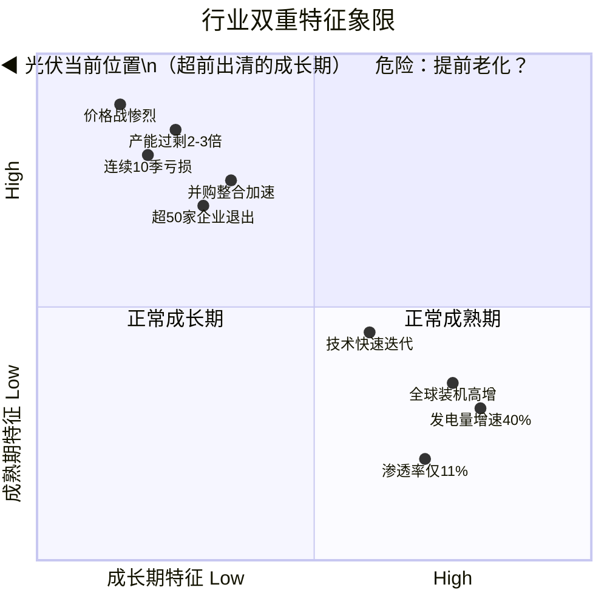

#### 关键渗透率数据

| 指标 | 2025年底数据 | 阶段判断 |
|------|-------------|----------|
| 光伏发电量 / 全社会用电量 | **约11%** | 接近导入期→成长期门槛（15%） |
| 光伏累计装机 / 全国发电总装机 | **30.6%** | 成长期特征 |
| 风光新增装机 / 全国新增装机 | **约80%** | 成长期特征 |
| 光伏发电量增速 | **同比+40%** | 成长期典型增速 |

#### 为什么判断为"成长期→成熟期过渡"而非简单"成长期"？

行业呈现出**两种阶段叠加**的复杂特征：

| 成长期特征 | 成熟期特征 |
|-----------|-----------|
| 发电量渗透率仅11%，空间巨大 | 全产业链产能过剩2-3倍 |
| 新增装机仍在高速增长（2025年同比+39%） | 价格战惨烈，组件跌超六成 |
| 技术快速迭代（TOPCon→BC→钙钛矿） | 行业连续亏损10个季度 |
| 全球装机预计2030年超5TW | 超50家企业退出，并购整合加速 |

**结论**：这是一个"超前进入成熟期调整的成长期行业"——需求端仍在高速成长，但供给端超前建设导致阶段性的成熟期价格战和出清。这属于方法论中提到的**非线性演化**：成长期中因为过度投资而提前经历成熟期的"出清"过程。

#### 未来演化路径

出清完成后（预计2026Q3-Q4至2027年），行业将**回归成长期中段的增长轨道**，届时发电量渗透率预计将突破15%，正式进入成长期加速阶段。

---

## 三、规模性分析（成长期核心）

### 3.1 市场规模测算

#### 当前市场规模（2025年基准）

| 口径 | 装机量 | 金额估算 |
|------|--------|----------|
| 全球新增装机 | ~600 GW | 组件市场约4200亿元（按0.7元/W） |
| 中国新增装机 | ~317 GW | 约2200亿元 |
| 全球光伏累计装机 | ~2,000 GW | — |

#### 未来3-5年情景预测

| 情景 | 2027年全球装机 | 2030年全球装机 | 关键假设 |
|------|---------------|---------------|----------|
| **乐观** | 800 GW | 1,200 GW | 碳中和加速、新兴市场爆发、储能成本大降 |
| **中性** | 650 GW | 850 GW | "十五五"政策平稳推进、市场化电价过渡 |
| **悲观** | 500 GW | 600 GW | 消纳瓶颈恶化、贸易壁垒全面升级 |

#### TAM / SAM / SOM

| 口径 | 含义 | 测算 |
|------|------|------|
| **TAM** 理论市场 | 全球电力全部由光伏替代 | ~30,000 GW装机容量，约20万亿元 |
| **SAM** 可服务市场 | 2030年技术/政策可支撑的装机 | 约5,000 GW累计，约3.5万亿元 |
| **SOM** 可获得市场（中国头部企业） | 中国维持80%全球份额 | 2030年约680 GW/年出货 |

#### 自下而上验证

```
单瓦组件价格 × 全球年装机量 = 行业年收入
0.8元/W × 650GW = 5,200亿元（组件环节）
全产业链（含硅料到电站）：约1.5-2万亿元/年
```

**关键结论**：即使进入成熟期增速放缓，光伏仍是一个**万亿级赛道**，且发电量渗透率仅11%，长期空间确定性极高。

---

## 四、防守性分析（护城河评估）

### 4.1 当前阶段护城河排序

光伏行业正处于"技术差异化 + 成本领先"双维竞争阶段，护城河正在从**规模经济**向**技术溢价**迁移：

| 护城河类型 | 典型企业 | 壁垒强度 | 可持续性评估 |
|-----------|---------|---------|-------------|
| **规模经济 + 成本** | 通威（硅料成本最低）、晶科（组件出货第一） | ★★★ | 随产能过剩减弱 |
| **技术差异化** | 隆基（BC）、爱旭（ABC） | ★★★★ | 2-3年技术领先窗口 |
| **渠道 + 品牌** | 晶科（海外60-65%）、天合（储能渠道） | ★★★ | 海外渠道壁垒可持续 |
| **转换成本** | 几乎没有（组件同质化） | ★ | 不做为主要护城河 |
| **资源垄断** | 通威（云南水电硅）、协鑫（颗粒硅专利） | ★★★ | 有限 |

### 4.2 当前护城河评级

| 企业 | 护城河宽度 | 核心壁垒 | 风险 |
|------|-----------|---------|------|
| **隆基绿能** | 中等偏宽 | BC技术领先 + 品牌 + 资金充沛（526亿货币资金） | BC渗透率提升速度 |
| **通威股份** | 中等 | 硅料成本优势（现金成本2.7万/吨）+ 一体化 | 硅料产能出清速度 |
| **晶科能源** | 窄 | 海外渠道 + TOPCon出货第一 | 技术差异不足 |
| **阳光电源** | 宽 | 逆变器品牌 + 储能全球渠道 | 竞争加剧 |

**关键判断**：光伏行业整体护城河偏窄，但在**技术路线切换期（PERC→TOPCon→BC→钙钛矿）**，技术领先者可获得2-3年的超额利润窗口。

---

## 五、盈利性分析（竞争格局）

### 5.1 产能周期位置

#### 图3：光伏产能周期全景图（产能-利润-价格联动）

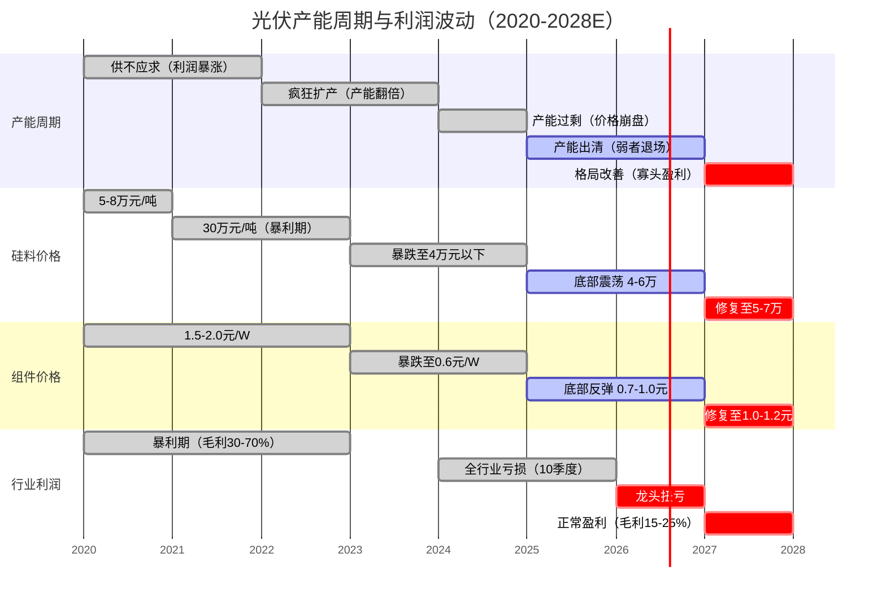

> **当前所处位置**（绿色 active 条）：产能出清中后期，价格底部震荡，行业仍亏损但收窄。**红色 crit 区间**是未来修复方向。

#### 图4：产能周期阶段判定（当前在哪个位置）

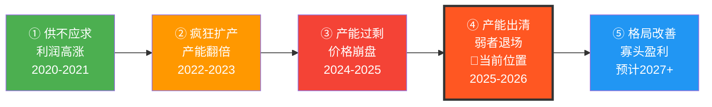

**当前处于"产能出清中后期"**，正在从"弱者退场"向"格局改善"过渡。

### 5.2 竞争格局量化

#### 市场集中度（CR5）

| 环节 | CR5 | 趋势 | 判断 |
|------|-----|------|------|
| 硅料 | 55% → 目标80%+ | ↑ 快速提升 | 通威整合进行中 |
| 硅片 | 60% | → 稳定 | 产能过剩超200% |
| 电池片 | 65% | ↑ N型集中 | 技术换代驱动集中 |
| 组件 | ~60% | ↑ 加速出清 | 超30%中小企业已退出 |

#### 波特五力分析

| 力量 | 强度 | 说明 |
|------|------|------|
| **现有企业竞争** | ★★★★★ 极度激烈 | 产能过剩2-3倍，价格战，连续10季度亏损 |
| **新进入者威胁** | ★★ 低 | 资本壁垒高，亏损期新进入者极少 |
| **供应商议价力** | ★★★ 中 | 银浆（银价飙160%）压力大，硅料供给宽松 |
| **买方议价力** | ★★★★ 高 | 组件同质化，央企招标主导，价格透明 |
| **替代品威胁** | ★ 极低 | 光伏已是最廉价能源形式 |

### 5.3 产业链利润分配

#### 图5：产业链各环节毛利率演变（2022 vs 2025H1 vs 2026Q1）

```mermaid
---
title: 光伏产业链各环节毛利率演变
---
xychart-beta
    title "各环节毛利率对比 (%)"
    x-axis ["硅料", "硅片", "电池片", "组件", "逆变器", "储能"]
    y-axis "毛利率 (%)" -25 --> 80
    bar "2022年（暴利期）" [73, 27, 18, 12, 33, 20]
    bar "2025H1（亏损期）" [-6.3, -15, -7.4, 0.7, 42, 27]
    bar "2026Q1（修复期）" [5, -16, 17.5, 6.5, 43, 30]
```

> **核心信号**：电池片修复最快（-7.4% → 17.5%），硅片仍深度亏损（-16%），逆变器/储能一枝独秀。

#### 图6：组件价格走势与行业盈利拐点

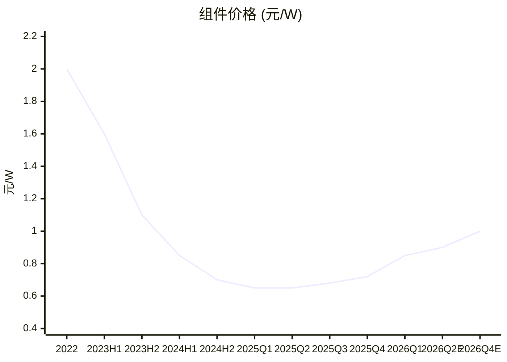

> 组件价格从2022年高点2.0元/W跌至2025年最低0.6元/W（跌幅70%），2026年Q1已反弹至0.79-0.92元/W，确认底部。

#### 图7：产业链利润池演变（从"上游暴利"到"下游修复"）

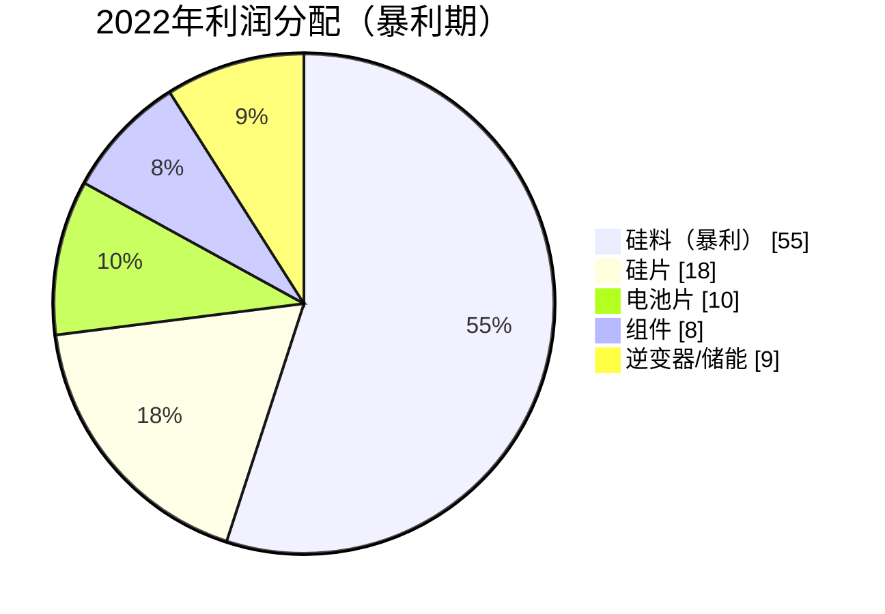

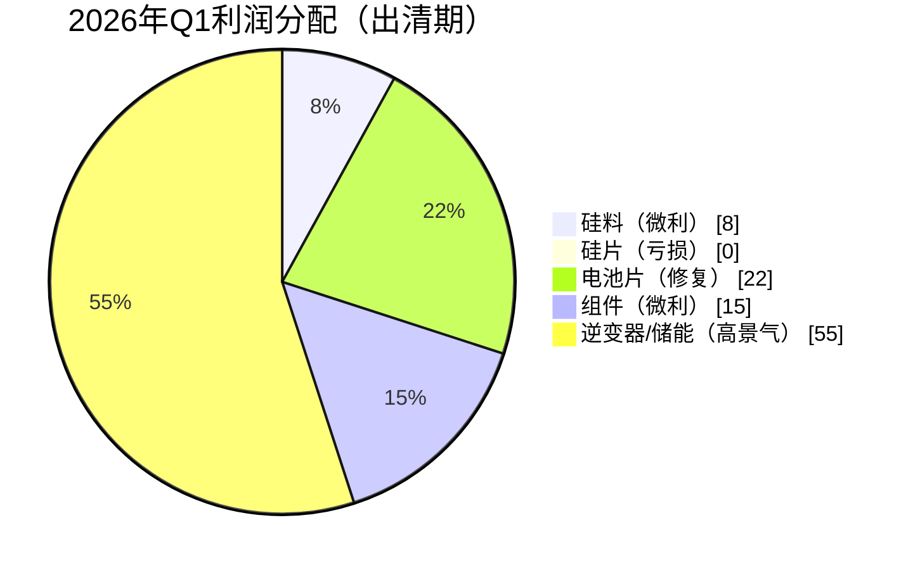

> 利润池从"上游硅料独吞55%"变为"逆变器/储能占半壁江山"。待出清完成后，利润将重新向技术领先的组件/电池龙头回流。

| 环节 | 2022年毛利 | 2025年H1 | 2026年Q1 | 修复方向 |
|------|-----------|----------|----------|---------|
| 硅料 | 73% | -6.3% | 微利~5% | ✅ 缓慢修复 |
| 硅片 | 25-30% | -10%~-20% | -14%~-19% | ❌ 最惨烈 |
| 电池片 | 15-20% | -7.4% | 17.5% | ✅ 最快修复 |
| 组件 | 10-15% | 0.67% | 5-8% | ✅ 缓慢修复 |
| 逆变器 | 30-35% | 35-50% | 36-51% | ✅ 持续高景气 |
| 储能 | — | 20-35% | 25-36% | ✅ 增长最快 |

#### 2026年Q1头部公司毛利率对比

```
隆基绿能：-1.19%   ← BC产品有溢价但整体仍亏
通威股份：-4.03%   ← 硅料环节结构性亏损
晶科能源：6.16%    ← 海外收入65%对冲国内亏损
天合光能：6.75%    ← 储能贡献增量利润
晶澳科技：1.12%    ← 一体化勉强盈亏平衡
```

### 5.4 产能出清进度

| 指标 | 数据 |
|------|------|
| 已退出企业 | 超50家（2025年）、超30%中小企业退出 |
| 硅料落后产能出清目标 | 超60万吨（计划中） |
| 龙头并购整合 | 通威收购青海利豪、TCL中环收购一道新能源 |
| 行业开工率 | 硅料37%、硅片50+%、电池53%、组件52% |

**关键判断**：出清已过半，但**硅片环节仍是最痛点**，预计还需要2-3个季度完成主要出清。

---

## 六、估值逻辑

### 6.1 当前估值框架

由于行业大范围亏损，传统PE估值失效。当前应使用**多维估值框架**：

| 估值方法 | 适用性 | 当前信号 |
|----------|--------|----------|
| **PB（市净率）** | ★★★★★ 首选 | 主链1-2.5倍，历史底部 |
| **前瞻PE（2027E）** | ★★★★ 辅助 | 龙头2027E PE约15-30倍 |
| **PS（市销率）** | ★★★ 参考 | 营收仍在增长 |
| **周期股框架** | ★★★★ 适用 | "底部买入、顶部卖出"逻辑 |

### 6.2 重点标的估值一览

#### 图9：光伏龙头PB估值对比（当前 vs 历史中枢）

```mermaid
---
title: 光伏龙头 PB 估值处于历史底部
---
xychart-beta
    title "光伏龙头市净率 (PB) 对比"
    x-axis ["隆基绿能", "通威股份", "晶科能源", "天合光能", "晶澳科技", "协鑫科技\n(HK)", "阳光电源"]
    y-axis "PB (倍)" 0 --> 6
    bar "当前PB" [1.9, 1.9, 1.5, 0.9, 0.8, 0.7, 4.5]
    bar "历史PB中位数" [4.5, 3.8, 3.2, 2.8, 2.5, 2.0, 6.5]
```

> 几乎所有龙头PB都处于历史最低分位，天合/晶澳/协鑫已跌破1倍净资产。

| 公司 | 代码 | 当前PB | 2027E PE（机构一致预期） | 货币资金(亿) | 估值判断 |
|------|------|--------|-------------------------|-------------|----------|
| 隆基绿能 | 601012 | ~1.9x | 18-22x | 526 | 低估 |
| 通威股份 | 600438 | ~1.9x | 12-18x | 213 | 合理偏低 |
| 晶科能源 | 688223 | ~1.5x | 14-20x | 281 | 低估 |
| 天合光能 | 688599 | ~0.9x | 10-15x | 224 | 低估 |
| 晶澳科技 | 002459 | ~0.8x | 12-18x | 233 | 低估 |
| 阳光电源 | 300274 | ~4.5x | 18-25x | — | 合理 |
| 协鑫科技 | 03800.HK | ~0.7x | 18x | — | 深度低估 |

### 6.3 估值核心逻辑

当前光伏板块估值的核心矛盾：

> **悲观面**（已Price-in）：全行业亏损、产能过剩、出口退税取消、贸易壁垒  
> **乐观面**（尚未定价）：供给出清后盈利弹性、BC/钙钛矿技术溢价、储能第二曲线

**中金公司判断**（2025年12月）：2026年是光伏主产业链**逆转之年**，Q2是关键窗口。

**核心投资逻辑**：
- 当前PB处于历史最低5%分位数 → 下行空间有限
- 盈利拐点（2026Q3-Q4）→ 一旦扭亏，PE将从"无效"变为"有效"，吸引增量资金
- 周期股逻辑：在行业最差时买入，在盈利高峰时卖出

---

## 七、PEST 外部因素分析

### 7.1 Political 政治政策

| 因素 | 影响 | 方向 |
|------|------|------|
| 136号文（市场化电价） | 2025年引发抢装潮，2026年需求回落 | ⚠️ 短期偏空 |
| "反内卷"政策密集出台 | 加速落后产能退出，利好龙头 | ✅ 中长期利好 |
| 出口退税归零（2026年4月） | 增加出口成本0.06-0.07元/W | ⚠️ 短期冲击 |
| 双碳国策不动摇 | 总理专题学习明确支持分布式光伏 | ✅ 长期利好 |
| 美国全方位封锁（双反+FEOC） | 对美出口通道彻底关闭 | ⚠️ 已Price-in |
| 欧盟CBAM碳边境税 | 碳足迹合规增加成本 | ⚠️ 壁垒提升 |
| 东南亚双反（税率最高307%） | 转口路径被封堵 | ⚠️ 已Price-in |

**政策核心逻辑转变**：从"补贴出口"到"价值竞争"，政府不再用退税补贴海外消费者，而是倒逼行业优胜劣汰。**长期有利于行业健康发展**。

#### 图：PEST 综合影响力评估

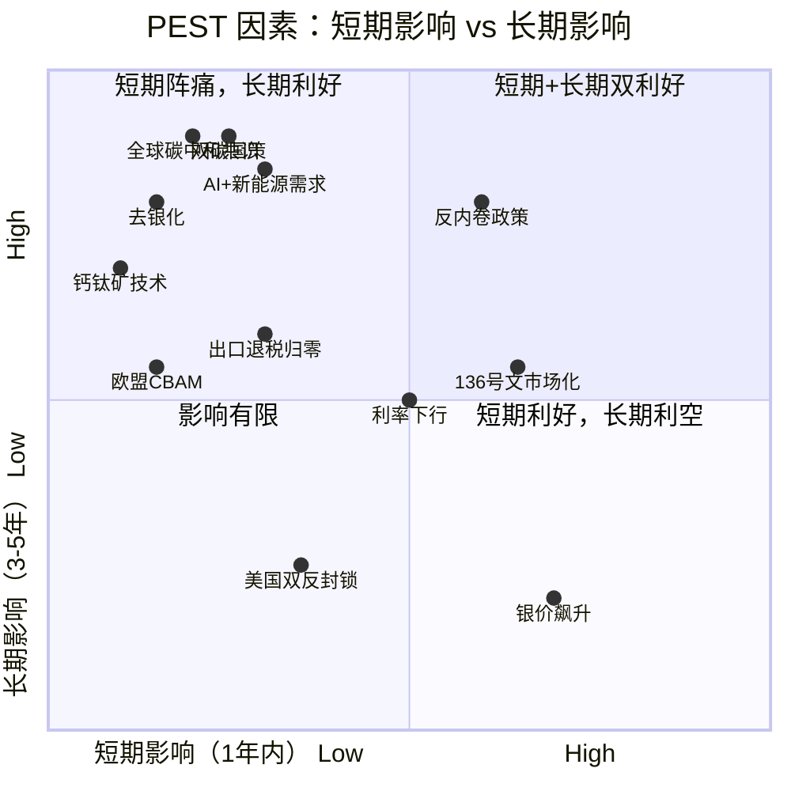

> **关键解读**：双碳国策 + 全球碳中和共识位于右上角（长期高度利好），反内卷政策短期就开始见效。银价飙升仅短期扰动，去银化将消除此风险。

### 7.2 Economic 经济环境

| 因素 | 现状 | 影响 |
|------|------|------|
| 全行业亏损 | 2025年龙头合计亏超400亿 | 加速出清，估值触底 |
| 利率环境 | 国内宽松、海外高利率回落 | 利好电站IRR |
| 银价飙升 | 两年涨超140%，银浆成第一大成本 | 推动去银化技术 |
| 组件价格 | 从0.6元/W反弹至0.79-0.92元/W | 确认价格底部 |

### 7.3 Social 社会文化

| 因素 | 影响 |
|------|------|
| 全球碳中和共识强化 | 光伏长期需求确定性极高 |
| 能源安全诉求（俄乌/中东） | 各国加速能源独立 |
| 分布式光伏"全民参与" | 户用+工商业成为增长极 |
| 光伏治沙/农光互补 | 拓展应用场景 |

### 7.4 Technological 技术环境

#### 图8：光伏电池技术路线市占率演变与预测

```mermaid
---
title: 电池技术路线市占率演变
---
xychart-beta
    title "各技术路线市占率 (%)"
    x-axis ["2020", "2021", "2022", "2023", "2024", "2025", "2026E", "2027E", "2028E"]
    y-axis "市占率 (%)" 0 --> 100
    bar "PERC（老一代）" [95, 91, 88, 70, 40, 20, 5, 2, 1]
    bar "TOPCon（主力）" [0, 0, 0, 25, 50, 55, 45, 35, 28]
    bar "BC（崛起）" [0, 0, 0, 3, 8, 15, 30, 38, 40]
    bar "HJT" [5, 9, 12, 2, 2, 5, 10, 12, 15]
    bar "钙钛矿叠层" [0, 0, 0, 0, 0, 5, 10, 13, 16]
```

> BC市占率从2025年15%快速提升至2026年30%+，是未来2-3年最确定的技术趋势。

| 技术路线 | 量产效率 | 市占率趋势 | 代表企业 |
|----------|---------|-----------|---------|
| **TOPCon** | 25.8% | 50%+ (主力) | 晶科、天合、晶澳 |
| **BC（背接触）** | 26.5%+ | 快速提升（目标30%+） | 隆基、爱旭 |
| **HJT（异质结）** | 26%+ | 10%（缓慢增长） | 东方日升 |
| **钙钛矿/叠层** | 27%+（实验室） | GW级量产元年 | 协鑫光电等 |
| **去银化** | 银包铜/铜电镀 | 加速推广中 | 帝科、聚和 |

**关键技术趋势判断**：
- BC电池是**2-3年内最确定性**的差异化方向（隆基、爱旭先行者红利）
- 钙钛矿是**5-10年的终局路径**，当前仍处于导入期
- 去银化是**成本端的革命性变化**，可大幅降低组件成本

---

## 八、景气度跟踪指标

对于光伏投资者，建议持续跟踪以下高频指标：

### 8.1 周度/月度指标（高频）

| 指标 | 数据来源 | 观察要点 |
|------|---------|---------|
| 硅料/硅片/电池/组件价格 | Solarzoom / PV InfoLink | 价格企稳回升 = 需求回暖 |
| 组件招标价格 | 央企招标公告 | 中标价是否持续高于0.8元/W |
| 多晶硅致密料价格 | 硅业分会 | 能否站稳5万元/吨以上 |
| 银浆价格 | 上海有色网 | 银价回落 = 电池利润修复 |
| 光伏出口数据（量+价） | 海关总署 | 出口量价双升 = 海外需求好 |
| 组件开工率 | 行业周度调研 | 龙头开工率 > 70% = 需求旺 |

### 8.2 季度指标（中频）

| 指标 | 来源 | 观察要点 |
|------|------|----------|
| 国内新增装机量 | 国家能源局 | 2026年目标180-250GW |
| 头部公司毛利率 | 季报/中报 | 毛利率转正 = 拐点确认 |
| 头部公司经营性现金流 | 季报 | 正现金流 = 盈利质量好 |
| 全球装机数据 | BNEF / IEA | 全球需求态势 |
| 产能退出公告 | 公司公告 | 出清加速度 |

### 8.3 关键拐点信号（重点观察）

| 信号 | 含义 | 当前状态 |
|------|------|----------|
| ~~龙头毛利率转正~~ | 盈利拐点 | ✅ 部分已实现（2026Q1组件龙头毛利率正） |
| ~~价格触底反弹~~ | 行业底部确认 | ✅ 组件0.6→0.8+元/W |
| 龙头单季扭亏为盈 | 盈利拐点确认 | ⏳ 预计2026Q3-Q4 |
| 落后产能大规模退出 | 供给出清加速 | ⏳ 进行中，目标出清60万吨硅料+ |
| 行业CR5持续提升 | 格局改善 | ⏳ 进行中 |

---

## 九、综合结论与投资建议

### 9.1 行业核心逻辑总结

#### 图10：光伏投资时钟 —— 当前所处阶段与策略

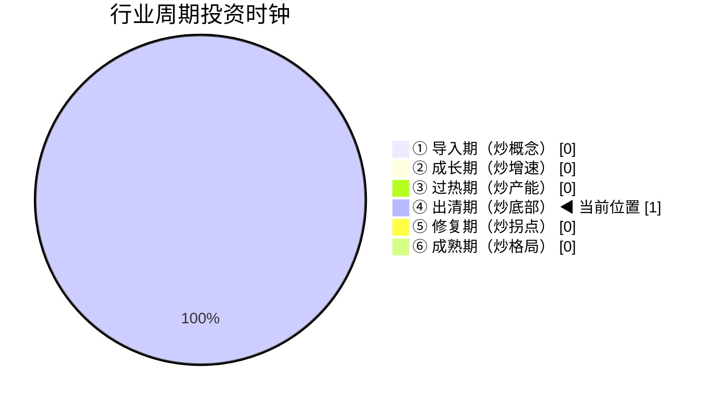

#### 图11：光伏投资策略路线图

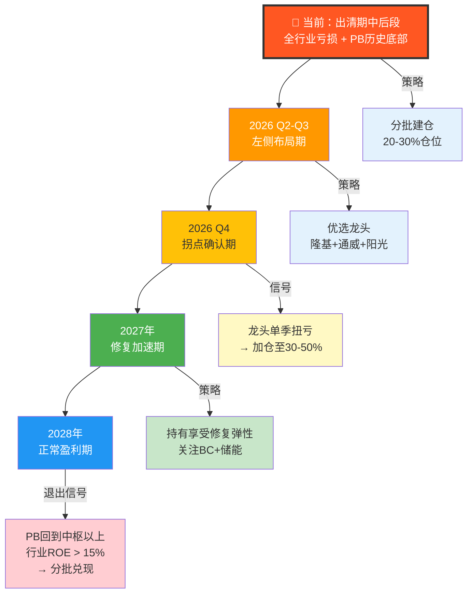

#### 图12：投资组合配置建议

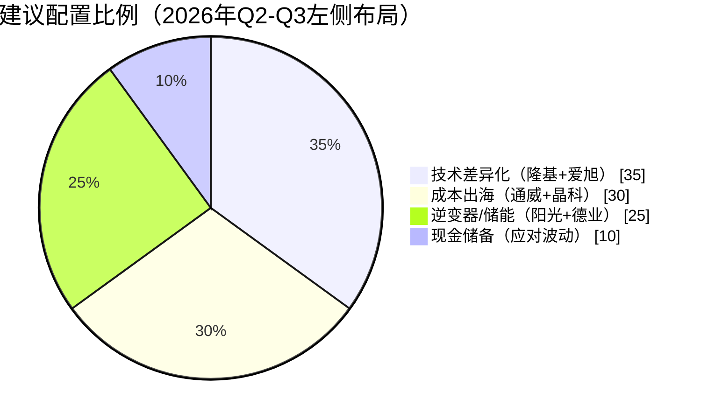


┌──────────────────────────────────────────┐
│  光伏行业 = 成长期赛道 + 成熟期出清      │
│                                          │
│  长期确定性：发电量渗透率仅11%，空间巨大 │
│  中期出清中：产能加速退出，2026H2拐点可期│
│  短期阵痛中：全行业亏损，但底部信号明确  │
│                                          │
│  当前 = 周期底部 + 成长起点               │
└──────────────────────────────────────────┘
```

### 9.2 三条投资主线

#### 主线一：技术差异化龙头（进攻型）

| 标的 | 逻辑 | 催化剂 |
|------|------|--------|
| **隆基绿能** | BC技术溢价 + 资金最充裕 + 品牌最强 | BC渗透率突破30%、单季扭亏 |
| **爱旭股份** | ABC纯BC标的 + 亏损大幅收窄 | ABC出货超预期 |

#### 主线二：成本+出海龙头（稳健型）

| 标的 | 逻辑 | 催化剂 |
|------|------|--------|
| **通威股份** | 硅料成本全行业最低 + 一体化 | 硅料价格站稳5万+、收储落地 |
| **晶科能源** | 海外收入65%对冲国内 + TOPCon出货第一 | 出口量价双升 |

#### 主线三：储能/逆变器（高景气确定型）

| 标的 | 逻辑 | 催化剂 |
|------|------|--------|
| **阳光电源** | 逆变器全球龙头 + 储能高增（增速近50%） | 全球储能装机超预期 |
| **德业股份** | 户用储能+逆变器细分龙头 | 新兴市场需求爆发 |
| **阿特斯** | 大储+组件双轮驱动 | 大储订单持续落地 |

### 9.3 风险提示

| 风险 | 严重程度 | 应对 |
|------|---------|------|
| **出清时间超预期**（延至2027年） | ★★★★ | 分批建仓，控制在3-5%仓位 |
| **2026年国内装机首次负增长**（-20%~-40%） | ★★★ | 优先选海外收入占比高的标的 |
| **银价继续飙升** | ★★★ | 关注去银化技术进度 |
| **贸易摩擦全面升级** | ★★ | 优选已有海外产能布局的企业 |
| **新技术颠覆（钙钛矿提前量产）** | ★★ | 关注技术路线，BC为2-3年安全选择 |
| **电价市场化后IRR恶化** | ★★★ | 关注配储和电力交易能力 |

### 9.4 投资策略建议

```
时间维度          策略                        仓位建议
──────────────────────────────────────────────────
2026年Q2-Q3      左侧布局，优选龙头          20-30%
                 隆基 + 通威 + 阳光电源
                 
2026年Q4-2027Q1  拐点确认后加仓              30-50%
                 增加晶科、天合、德业

2027-2028        持有享受盈利修复弹性         维持核心仓位
                 关注BC和储能标的
──────────────────────────────────────────────────
止损条件：龙头连续3季度未扭亏 / 组件价格跌破0.7元/W / 全球装机增速转负
```

### 9.5 一句话结论

> **光伏行业正处于"黎明前的黑暗"——成长期赛道的长期确定性未变（发电量渗透率仅11%），但供给过剩带来短期阵痛。2026年下半年大概率迎来盈利拐点，当前历史最低PB估值提供了较好的安全边际。建议以"周期底部 + 成长起点"的双重逻辑，在Q2-Q3分批布局技术领先（BC路线）和成本领先（硅料龙头）的核心标的，辅以储能/逆变器的高景气敞口。**

---

## 报告更新提示

本报告基于截至2026年5月29日的公开数据和研报信息。建议重点关注以下节点并更新判断：

- **2026年7月**：光伏企业Q2业绩预告 → 验证拐点是否来临
- **2026年8月**：中报披露 → 毛利率和现金流变化
- **2026年10月**：Q3业绩 → 是否实现单季扭亏
- **2026年12月**：全年装机数据 → 需求是否超预期

---

*免责声明：本报告仅为行业分析框架下的独立研究，不构成任何投资建议。股票投资有风险，入市需谨慎。报告中的数据和观点均来自公开信息和券商研报，可能存在时效性差异。*
