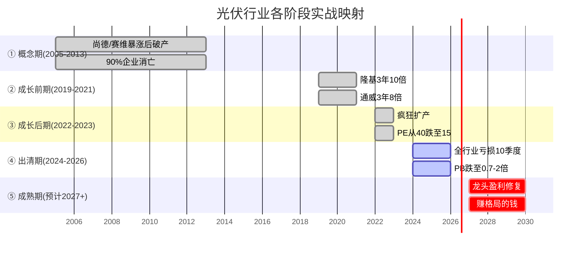
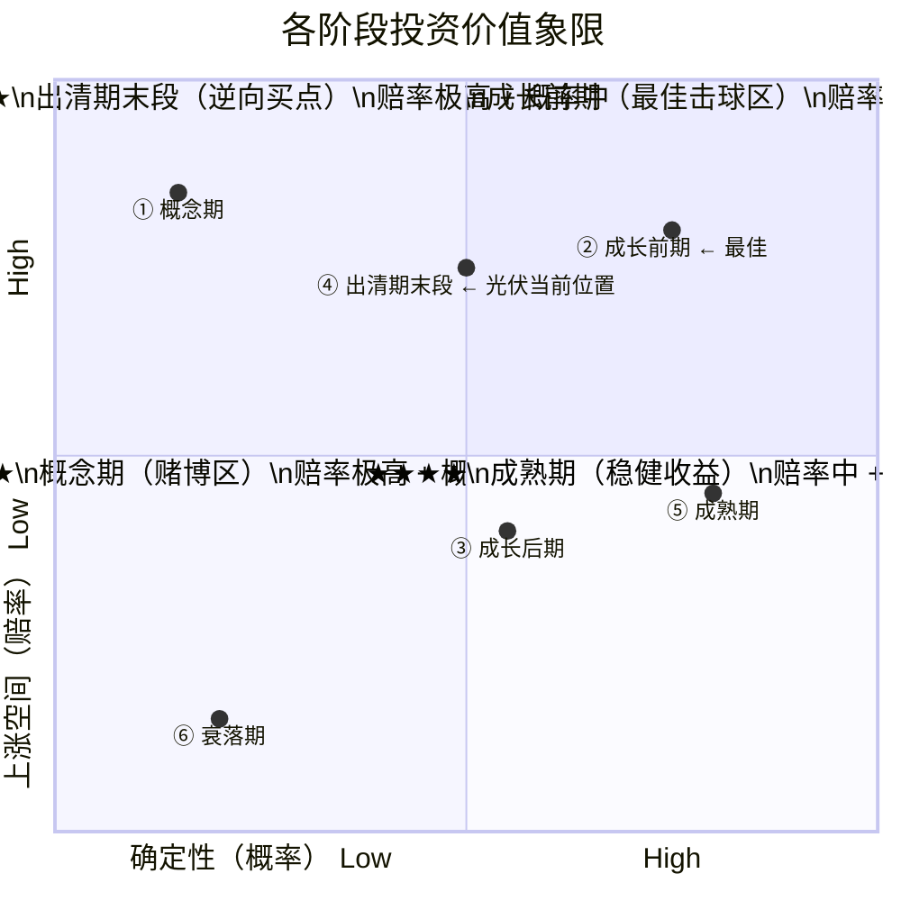
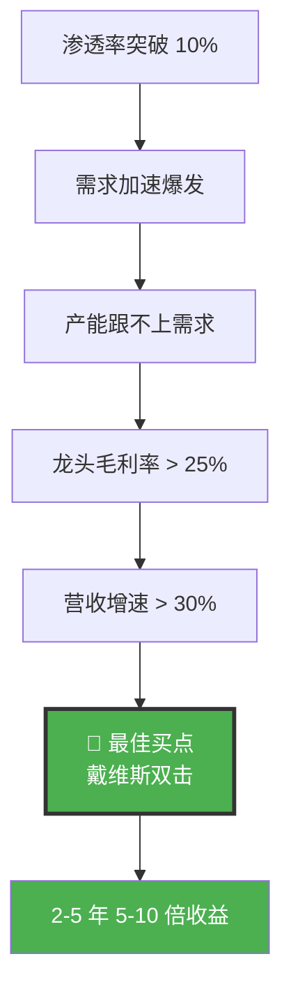
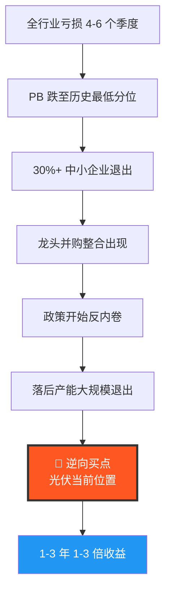
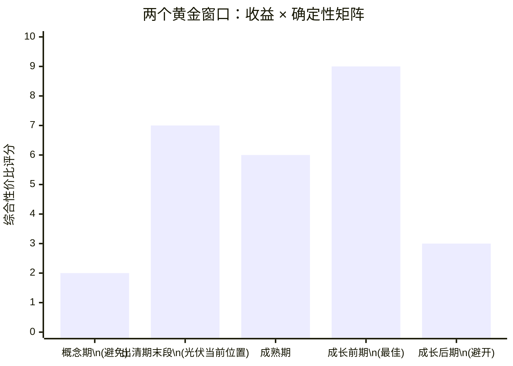
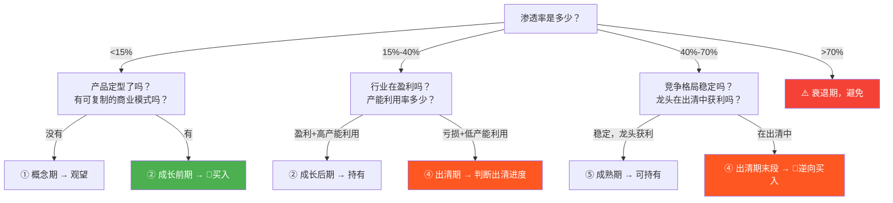

# 行业生命周期与最佳投资窗口分析

**分析日期**：2026年5月29日  
**核心方法论**：基于肖璟《如何快速了解一个行业》+ 实战经验归纳

---

## 一、行业生命周期按什么划分？

以**渗透率**为唯一标尺，不看增速快慢、也不看行业存在了多少年：

| 渗透率区间 | 阶段 | 一句话特征 |
|-----------|------|-----------|
| **< 15%** | 导入期 | 产品没定型，大部分人没用过，商业模式在试错 |
| **15% ~ 40%** | 成长期 | 需求爆发，人人想进场，产能跟不上需求 |
| **40% ~ 70%** | 成熟期 | 增速放缓，格局稳定，大鱼吃小鱼 |
| **> 70%** | 衰退期 | 需求见顶，替代品出现，价格和毛利被压缩 |

### 为什么用渗透率而不是增速？

增速是**结果**，渗透率是**原因**。一个行业增速从 50% 掉到 20%，如果渗透率才 10%，它依然是成长期——增速下降只是因为基数变大。反过来，渗透率已到 60%，哪怕某年增速还有 25%（政策刺激），本质上已是成熟期。

### 产业生命周期S曲线

```mermaid
---
title: 产业生命周期 S 曲线（以渗透率为轴心）
---
xychart-beta
    title "产业生命周期 S 曲线"
    x-axis ["导入期\n渗透率 < 15%", "成长期前期\n15%-25%", "成长期后期\n25%-40%", "成熟期\n40%-70%", "衰退期\n> 70%"]
    y-axis "渗透率 (%)" 0 --> 100
    line "标准S曲线" [3, 10, 18, 28, 35, 48, 58, 65, 72, 78]
    scatter "当前光伏\n(渗透率~11%)" [1.5, 11]
```

> **当前光伏位置**：发电量渗透率约 11%，处于导入期末端 → 成长期前端的临界位置。但供给端超前建设导致成熟期的"产能出清"特征提前出现——这是非典型的非线性演化。

---

## 二、一个股票会经历哪些时期？

行业生命周期是四个阶段，但映射到**股价**上，会有六个阶段：

### 全景图


### 各阶段详解

```
┌──────────────────────────────────────────────────────────────────────────┐
│  阶段        核心逻辑          典型股价表现         估值方式   投资价值  │
├──────────────────────────────────────────────────────────────────────────┤
│                                                                          │
│  ① 概念期    炒想象空间        暴涨暴跌              梦想估值    ★★     │
│              公司可能还没收入  90%公司死在这里        PS也不适用         │
│                                                                          │
│  ② 成长前期  炒增速            戴维斯双击             PEG/PS    ★★★★★★ │
│   ←最佳     业绩持续超预期    股价5-10倍常见          营收增速30%+       │
│                                                                          │
│  ③ 成长后期  炒格局            股价波动加大            PEG→PE    ★★★    │
│              产能开始过剩      估值中枢从40PE→15PE    切换阵痛          │
│                                                                          │
│  ④ 出清期    炒底部            股价腰斩再腰斩          PB        ★★★★   │
│   ←逆向     全行业亏损         无人敢买时见底          周期框架          │
│                                                                          │
│  ⑤ 成熟期    炒确定性          稳步上涨               PE/股息率  ★★★★   │
│              龙头赚超额利润    涨幅收窄但确定性极高                      │
│                                                                          │
│  ⑥ 衰落期    炒退出            阴跌或僵尸化           PB陷阱     ★      │
│              低PE ≠ 便宜       戴维斯双杀                               │
│                                                                          │
└──────────────────────────────────────────────────────────────────────────┘
```

### 光伏行业的完整对应



### 重要警示

> 不是所有行业都会完整经历六个阶段：
> - 从导入期**直接死掉**（伪需求，如元宇宙硬件）
> - 成熟期**开辟第二曲线**，重回成长前期（光伏 + 储能 = 下一个成长期起点）
> - 成熟期**稳定周期化**（如白酒、银行 → 周期性波动而非线性衰落）

---

## 三、最具投资价值的时期是什么？

### 投资价值 = 赔率 × 概率



### 两个黄金窗口，对应两种投资风格

#### 窗口一：成长前期 —— "最肥美的鱼身" ⭐⭐⭐⭐⭐⭐



| 维度 | 说明 |
|------|------|
| **为什么好** | 渗透率加速突破 15%→25%，业绩加速 + 估值扩张（戴维斯双击） |
| **收益空间** | 2-5 年 5-10 倍 |
| **难度** | 极高 — 需要在前一阶段准确判断"这是真需求" |
| **代表案例** | 隆基 2019-2021（3年10倍）、茅台 2014-2020（6年15倍） |
| **适合谁** | 成长股投资者、产业趋势派 |

**需盯住的信号**：

| 信号 | 阈值 |
|------|------|
| 渗透率 | 从 10% 向 25% 加速 |
| 龙头毛利率 | > 25% |
| 营收增速 | > 30% |
| 产能利用率 | > 85% |

#### 窗口二：出清期末段 → 成熟期初段 —— "周期底部逆向买点" ⭐⭐⭐⭐



| 维度 | 说明 |
|------|------|
| **为什么好** | 全行业亏损时无人敢买，PB 历史最低，供给出清后龙头享受格局红利 |
| **收益空间** | 1-3 年 1-3 倍 |
| **难度** | 中等 — 需要判断出清是否接近尾声（而非刚开始） |
| **代表案例** | 光伏 2026 正处于此位置 |
| **适合谁** | 逆向投资者、价值投资者 |

**需盯住的信号**：

| 信号 | 当前光伏状态 |
|------|-------------|
| 全行业亏损 4-6 季 | ✅ 已亏损 10 季 |
| 主链 PB < 1.5x | ✅ 0.7-2 倍 |
| 30%+ 中小企业退出 | ✅ 已超 30% |
| 龙头并购出现 | ✅ 通威收利豪、中环收一道 |
| 政策表态反内卷 | ✅ 反内卷攻坚年 |
| 价格底部确认并反弹 | ✅ 组件 0.6→0.85 元/W |

---

## 四、两窗口综合对比



| 维度 | 成长前期 | 出清期末段 | 成熟期 |
|------|---------|-----------|--------|
| 收益天花板 | ⭐⭐⭐⭐⭐⭐ | ⭐⭐⭐⭐ | ⭐⭐⭐ |
| 确定性地板 | ⭐⭐⭐ | ⭐⭐⭐⭐ | ⭐⭐⭐⭐⭐ |
| 持有期限 | 2-5 年 | 1-3 年 | 长期 |
| 最大回撤 | 可能 30-50% | 通常 10-20% | 通常 15-25% |
| 认知门槛 | 极高 | 中等 | 低 |
| 典型投资家 | 彼得·林奇 | 霍华德·马克斯 | 巴菲特 |

### 一句话总结

> **成长前期赚的是"增速的钱"（最肥），出清期末段赚的是"从亏到盈的修复钱"（最确定）。**
>
> 两者都是好买点：
> - 前者需要**前瞻判断力**——在别人没看懂时提前上车
> - 后者只需要**在所有人悲观的时候，有勇气看事实**——光伏当前就是后者
>
> **综合性价比最高 = 成长前期**，但难度最大；
> **光伏当前所处的 = 出清期末段**，赔率与确定性的结合仅次于成长前期。

---

## 五、实战应用：如何判断当前处于哪个阶段？

### 决策流程



### 光伏当前自查清单

| 维度 | 当前状态 | 结论 |
|------|---------|------|
| 发电量渗透率 | ~11% | 导入期末→成长期前 |
| 全行业盈亏 | 连续亏损 10 季 | 出清期特征 |
| 龙头 PB | 0.7-2 倍（历史底部） | 出清期尾部特征 |
| 中小企业退出 | > 30% 已退出 | 出清中后期 |
| 价格走势 | 组件从 0.6 反弹至 0.85 | 底部确认 |
| 政策态度 | 反内卷攻坚年 | 利好龙头 |

**综合判定 = 出清期末段，即将进入成熟期初段**

---

*免责声明：本报告仅为方法论探讨，不构成任何投资建议。股票投资有风险，入市需谨慎。*
